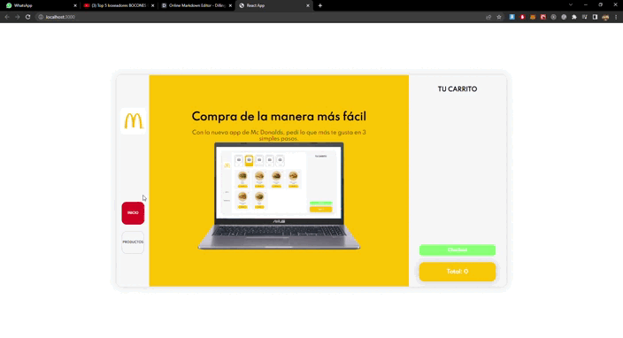

# Mc Donalds App  |  _Brian Rios - Curso React Coder House_

## `Antes de comenzar - ¿Cómo inicializar el proyecto?`

## Cargar productos en Firebase con los siguientes atributos:
- ID (automático)
- Nombre (name)
- Precio (price)
- Imagen (img)
- Categoria (category: Hot, Hamburguesas, Complementos, Bebidas, Helados)
- Descripción (description)
- Ingredientes (ingredients = [Carne, Pan, Tomate, etc])
- Stock (stock)

## Componentes

- Navbar (Navegación de la aplicación)
- Home (Página principal)
- MenuCategory (Navegación entre categorías de productos)
- ItemListContainer (Contenedor de la lista de productos)
- ItemList (Lista los productos)
- ItemCard (Producto individual)
- ItemDetailContainer (Contenedor del detalle del producto)
- ItemDetail (Detalle del producto)
- Counter (Controla la cantidad que se agrega al carrito del mismo producto, aumentando o decreciendo por medio de botones)
- Cart (Contenedor de los productos agregados al carrito, donde se almacena toda la información del mismo)
- ItemCart (Producto individual que se encuentra en el carrito)
- CartWidget (Widget que indica la cantidad de items agregados al carrito)
- Order (Toma los datos del cliente para generar la orden)

## Proceso para realizar una compra:

- Ir a "productos" en el navbar lateral
- Navegar entre las categorías, y elegir el producto que más te guste tocando "ver más"
- Seleccionar la cantidad del producto que quieras y agregalo al carrito.
- Desde la barra lateral derecha podes ver tu orden, y eliminar los productos que ya no quieras.
- Una vez que ya decidiste que llevar, presiona el botón de "checkout" y completa los datos.
- Se finaliza la compra y se restaura la app.

